# 🏗️ Arquitetura do Sistema

> **Visão completa da arquitetura do Pizza Prime**

---

## 📊 Visão Geral


---

## 🔄 Fluxo de Pedido Completo

```mermaid
sequenceDiagram
    participant U as Usuário
    participant F as Frontend<br/>(React)
    participant C as Cache<br/>(TanStack Query)
    participant EF as Edge Function<br/>(create-order)
    participant DB as Database<br/>(PostgreSQL)
    participant RT as Realtime<br/>(WebSocket)
    participant Admin as Admin Panel
    
    U->>F: Adiciona produtos ao carrinho
    F->>C: Busca produtos do cache
    C-->>F: Retorna produtos (staleTime: 5min)
    
    U->>F: Finaliza pedido
    F->>F: Validação local (items, total, address)
    F->>EF: POST /create-order-optimized
    
    EF->>DB: Verifica assinatura ativa
    DB-->>EF: Subscription OK
    
    EF->>DB: CALL atomic_reserve_stock(items)
    alt Estoque disponível
        DB-->>EF: Stock reservado ✅
        EF->>DB: INSERT INTO orders
        EF->>DB: INSERT INTO order_items
        DB->>RT: NOTIFY order_created
        RT-->>F: Broadcast: novo pedido
        RT-->>Admin: Broadcast: novo pedido
        EF-->>F: {orderId, status: 'pending'}
        F-->>U: Pedido confirmado! 🎉
    else Estoque insuficiente
        DB-->>EF: Error: insufficient stock ❌
        EF-->>F: {error: 'Estoque insuficiente'}
        F-->>U: Produto sem estoque
    end
    
    Admin->>DB: UPDATE order status = 'confirmed'
    DB->>RT: NOTIFY order_updated
    RT-->>F: Broadcast: pedido confirmado
    F-->>U: Notificação: "Pedido confirmado!"
```



---

## 💾 Estratégia de Cache (3 Camadas)


### Cache Strategies por Domínio

| Domínio | Strategy | Stale Time | GC Time | Refetch on Mount | Refetch on Window Focus |
|---------|----------|------------|---------|------------------|-------------------------|
| **categories** | STATIC | 24h | 48h | ❌ | ❌ |
| **subcategories** | STATIC | 24h | 48h | ❌ | ❌ |
| **products** | DYNAMIC | 5min | 10min | ✅ | ❌ |
| **orders** | REALTIME | 30s | 1min | ✅ | ✅ |
| **stock** | CRITICAL | 30s | 1min | ✅ | ✅ |
| **subscription** | SEMI_STATIC | 1h | 2h | ✅ | ❌ |
| **userProfile** | SEMI_STATIC | 1h | 2h | ✅ | ❌ |

**Implementação:**
```typescript
// src/config/queryCacheMapping.ts
import { applyStrategy } from '@/config/queryCacheMapping';

useQuery({
  queryKey: ['products'],
  queryFn: fetchProducts,
  ...applyStrategy('products'), // Aplica DYNAMIC strategy automaticamente
});
```

---

## 🔐 Segurança de Roles (RLS + Security Definer)

```mermaid
graph TD
    User[Usuário faz request]
    
    subgraph "Frontend"
        Check[useRole hook<br/>verifica role localmente]
    end
    
    subgraph "Database (RLS Enabled)"
        RLS[RLS Policy<br/>WHERE clause]
        Func[has_role function<br/>SECURITY DEFINER]
        Table[(user_roles table)]
    end
    
    User --> Check
    Check -->|API Request| RLS
    RLS --> Func
    Func --> Table
    Table -->|role = 'admin'| Allow[✅ Query Allowed]
    Table -->|role != 'admin'| Deny[❌ Query Denied]
    
    style Func fill:#90EE90
    style Table fill:#FFD700
```



### Funções Security Definer

```sql
-- has_role: Verifica se usuário tem role específica
CREATE OR REPLACE FUNCTION has_role(required_role text)
RETURNS boolean
LANGUAGE plpgsql
SECURITY DEFINER
SET search_path = public
AS $$
BEGIN
  RETURN EXISTS (
    SELECT 1 FROM user_roles 
    WHERE user_id = auth.uid() 
    AND role = required_role
  );
END;
$$;

-- has_any_role: Verifica se usuário tem qualquer das roles
CREATE OR REPLACE FUNCTION has_any_role(required_roles text[])
RETURNS boolean
LANGUAGE plpgsql
SECURITY DEFINER
SET search_path = public
AS $$
BEGIN
  RETURN EXISTS (
    SELECT 1 FROM user_roles 
    WHERE user_id = auth.uid() 
    AND role = ANY(required_roles)
  );
END;
$$;
```

### RLS Policies Exemplo

```sql
-- Apenas admins podem ver todos os pedidos
CREATE POLICY "Admins can view all orders"
ON orders FOR SELECT
USING (has_role('admin'));

-- Clientes veem apenas seus pedidos
CREATE POLICY "Customers can view own orders"
ON orders FOR SELECT
USING (user_id = auth.uid());

-- Atendentes podem atualizar status
CREATE POLICY "Attendants can update order status"
ON orders FOR UPDATE
USING (has_any_role(ARRAY['admin', 'attendant']));
```

---

## 📡 Realtime Architecture (Singleton Pattern)


### Uso no Frontend

```typescript
// src/services/realtime.ts
import { useOrdersRealtime } from '@/services/realtime';

// Hook auto-cleanup
const MyComponent = () => {
  useOrdersRealtime((payload) => {
    console.log('Order update:', payload);
    queryClient.invalidateQueries({ queryKey: ['orders'] });
  });

  return <div>...</div>;
};
```

---

## 🛠️ Stack Tecnológico

### Frontend


**Versões:**
- React: 18.3.1
- TypeScript: 5.x
- Vite: Latest
- TanStack Query: 5.56.2
- Zustand: 5.0.5
- Vitest: 4.0.4
- Playwright: 1.56.1

### Backend


**Características:**
- PostgreSQL 15 com RLS habilitado
- 30 Edge Functions (Deno runtime)
- Realtime via WebSocket (broadcasting automático)
- Storage com CDN integrado
- Auth com JWT tokens (refresh automático)

---

## 📦 Bundle Optimization

### Code Splitting Strategy

```typescript
// vite.config.ts
export default defineConfig({
  build: {
    rollupOptions: {
      output: {
        manualChunks: {
          // Vendor chunks
          'react-vendor': ['react', 'react-dom', 'react-router-dom'],
          'query-vendor': ['@tanstack/react-query'],
          'ui-vendor': ['@radix-ui/react-dialog', '@radix-ui/react-dropdown-menu'],
          
          // Feature chunks
          'admin': [
            './src/pages/admin/Dashboard.tsx',
            './src/components/AdminOrdersTable.tsx',
          ],
          'checkout': [
            './src/pages/Checkout.tsx',
            './src/pages/Payment.tsx',
          ],
        },
      },
    },
  },
});
```

### Lazy Loading

```typescript
// Lazy load de páginas
const AdminDashboard = lazy(() => import('@/pages/admin/Dashboard'));
const Checkout = lazy(() => import('@/pages/Checkout'));

// Lazy load de componentes pesados
const AdminOrdersTable = lazy(() => import('@/components/AdminOrdersTable'));
```

### Bundle Size

| Chunk | Size (gzipped) | Description |
|-------|----------------|-------------|
| **vendor-react** | ~140KB | React core |
| **vendor-query** | ~50KB | TanStack Query |
| **vendor-ui** | ~80KB | Radix UI components |
| **main** | ~150KB | App core + routing |
| **admin** | ~100KB | Admin features |
| **Total** | **~520KB** | Total bundle size |

---

## 🔍 Monitoramento e Observabilidade

### Real User Monitoring (RUM)

```mermaid
graph LR
    Browser[Browser<br/>Web Vitals API]
    
    subgraph "Frontend"
        Collector[RUM Collector<br/>Performance Observer]
    end
    
    subgraph "Backend"
        EF[store-rum-metrics<br/>Edge Function]
        DB[(rum_metrics table)]
    end
    
    subgraph "Analytics"
        Dashboard[Performance Dashboard<br/>Visualização]
    end
    
    Browser --> Collector
    Collector --> EF
    EF --> DB
    DB --> Dashboard
```



**Métricas coletadas:**
- **FCP** (First Contentful Paint)
- **LCP** (Largest Contentful Paint)
- **FID** (First Input Delay)
- **CLS** (Cumulative Layout Shift)
- **TTFB** (Time to First Byte)

### Error Tracking

```typescript
// src/utils/errorReporting.ts
const reportError = async (error: Error) => {
  await supabase.functions.invoke('store-error-reports', {
    body: {
      message: error.message,
      stack: error.stack,
      url: window.location.href,
      userAgent: navigator.userAgent,
    },
  });
};
```

---

## 🗄️ Database Schema (Simplificado)

### Principais Tabelas


---

## 🚀 Deployment Architecture


---

## 📈 Escalabilidade

### Horizontal Scaling

- **Frontend:** CDN global (Lovable/Vercel)
- **Backend:** Edge Functions auto-scaling (Deno Deploy)
- **Database:** Supabase auto-scaling (connection pooling)
- **Realtime:** WebSocket connections balanceadas

### Performance Targets

| Métrica | Target | Atual |
|---------|--------|-------|
| **First Load** | < 2s | ~1.8s |
| **Time to Interactive** | < 3s | ~2.5s |
| **Bundle Size** | < 600KB | ~520KB |
| **API Response** | < 200ms | ~150ms |
| **Realtime Latency** | < 100ms | ~80ms |

---

## 🔄 CI/CD Pipeline (Exemplo)

```yaml
# .github/workflows/ci.yml
name: CI/CD Pipeline

on: [push, pull_request]

jobs:
  test:
    runs-on: ubuntu-latest
    steps:
      - uses: actions/checkout@v3
      - uses: actions/setup-node@v3
      - run: npm ci
      - run: npm run test:coverage
      - run: npx playwright install
      - run: npm run test:e2e
      
  build:
    needs: test
    runs-on: ubuntu-latest
    steps:
      - uses: actions/checkout@v3
      - uses: actions/setup-node@v3
      - run: npm ci
      - run: npm run build
      - run: echo "Build size:" && du -sh dist
```

---

**Última atualização:** 2025-11-07
