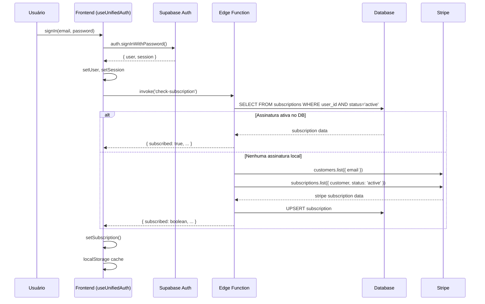
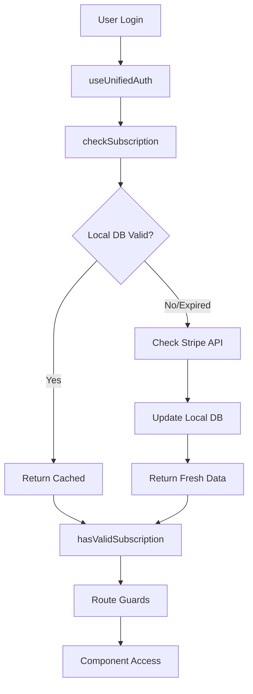

# 🔍 AUDITORIA COMPLETA - SISTEMA DE VERIFICAÇÃO DE ASSINATURA
## Projeto: Pizza Prime/Clube do Rei

**Data da Auditoria:** 25 de Setembro de 2025  
**Status:** CRÍTICO - Múltiplas inconsistências detectadas  
**Impacto:** Sistema de verificação confuso, duplicado e com potencial falha de segurança  

---

## 📂 1. MAPEAMENTO DE ARQUIVOS RELACIONADOS À SUBSCRIPTION

### 1.1 Arquivos Front-end (React)
| Arquivo | Linhas | Função Principal | Verificação de Assinatura |
|---------|--------|------------------|---------------------------|
| `src/hooks/useUnifiedAuth.tsx` | 708 | Hook central de autenticação e assinatura | ✅ `checkSubscriptionInternal()` (160-309), `hasValidSubscription()` (627-629) |
| `src/routes/UnifiedProtectedRoute.tsx` | 113 | Guard de rotas com verificação | ✅ Linha 101: `!subscription.subscribed` |
| `src/components/SubscriptionStatus.tsx` | 35 | UI de status visual | ✅ Linha 18: `hasValidSubscription()` |
| `src/components/SubscriptionPlans.tsx` | 144 | Interface de planos | ❌ Apenas exibe planos |
| `src/pages/SubscriptionPlans.tsx` | 89 | Página de planos | ❌ Apenas renderização |
| `src/pages/Dashboard.tsx` | 382+ | Dashboard principal | ✅ Usa `subscription` state |
| `src/pages/Index.tsx` | 118+ | Página inicial | ✅ Linha 32: `hasValidSubscription()` |

### 1.2 Edge Functions (Supabase)
| Arquivo | Função | Verificação Principal | Environment Variables |
|---------|--------|--------------------|---------------------|
| `supabase/functions/check-subscription/index.ts` | Verificação principal de assinatura | ✅ Stripe API + DB local | `STRIPE_SECRET_KEY`, `STRIPE_PRICE_ID_*` |
| `supabase/functions/validate-subscription-realtime/index.ts` | Validação em tempo real | ✅ Dupla verificação (DB + Stripe) | `STRIPE_SECRET_KEY` |
| `supabase/functions/stripe-webhook/index.ts` | Webhook Stripe | ✅ Sincronização automática | `STRIPE_SECRET_KEY`, `STRIPE_WEBHOOK_SECRET` |
| `supabase/functions/create-checkout/index.ts` | Criação de checkout | ❌ Apenas criação | `STRIPE_SECRET_KEY`, `STRIPE_PRICE_ID_*` |
| `supabase/functions/customer-portal/index.ts` | Portal do cliente | ❌ Apenas portal | `STRIPE_SECRET_KEY` |

### 1.3 Banco de Dados
**Tabela Principal:** `public.subscriptions`
```sql
-- Schema da tabela subscriptions
{
  id: uuid PRIMARY KEY,
  user_id: uuid REFERENCES profiles(id),
  stripe_subscription_id: text,
  stripe_price_id: text,
  status: subscription_status ENUM, -- 'active', 'inactive', 'pending', 'cancelled'
  plan_name: text,
  plan_price: numeric,
  expires_at: timestamp,
  sync_status: text, -- 'webhook', 'manual', 'pending'
  last_webhook_event: text,
  webhook_event_id: text,
  created_at: timestamp,
  updated_at: timestamp
}
```

---

## 🔧 2. FLUXO ATUAL DE VERIFICAÇÃO

### 2.1 Login/Registro do Usuário


### 2.2 Verificação em Rotas Protegidas
```javascript
// UnifiedProtectedRoute.tsx - Linha 101
if (requireSubscription && user && !subscription.loading && !subscription.subscribed && location.pathname === '/menu') {
  return <Navigate to="/plans" replace />;
}
```

### 2.3 Verificação em Componentes
```javascript
// useUnifiedAuth.tsx - Linha 627-629
const hasValidSubscription = useCallback(() => {
  return subscription.subscribed && subscription.status === 'active';
}, [subscription.subscribed, subscription.status]);
```

---

## ⚠️ 3. PROBLEMAS CRÍTICOS IDENTIFICADOS

### 🔴 CRÍTICO - Duplicação de Lógica de Verificação
**Arquivo:** `src/hooks/useUnifiedAuth.tsx` vs `supabase/functions/validate-subscription-realtime/index.ts`
- **Problema:** Duas edge functions fazem verificação similar
- **Linhas Afetadas:** useUnifiedAuth:160-309, validate-subscription-realtime:53-213
- **Impacto:** Conflitos de estado, chamadas desnecessárias à API do Stripe

### 🔴 CRÍTICO - Cache Inconsistente
**Arquivo:** `src/hooks/useUnifiedAuth.tsx`
- **Problema:** Cache no localStorage pode ficar desatualizado
- **Linhas Afetadas:** 168-195, 223-227, 264-267
- **Impacto:** Usuário pode acessar recursos premium sem assinatura válida

### 🔴 CRÍTICO - Race Condition no Auth State
**Arquivo:** `src/hooks/useUnifiedAuth.tsx`
- **Problema:** `checkSubscriptionInternal` pode ser chamado antes do user estar totalmente autenticado
- **Linhas Afetadas:** 90-96
- **Impacto:** Chamadas à edge function com token inválido

### 🟠 ALTO - Verificação Apenas em /menu
**Arquivo:** `src/routes/UnifiedProtectedRoute.tsx`
- **Problema:** Linha 101 só verifica assinatura se `location.pathname === '/menu'`
- **Impacto:** Outras rotas protegidas podem ser acessadas sem assinatura

### 🟠 ALTO - Múltiplos Hooks de Role
**Arquivos:** `src/hooks/useRole.tsx` vs `src/hooks/useUnifiedProfile.tsx`
- **Problema:** Lógica duplicada para verificação de papéis
- **Impacto:** Inconsistência entre componentes

### 🟡 MÉDIO - Fallback sem Verificação
**Arquivo:** `supabase/functions/check-subscription/index.ts`
- **Problema:** Linha 244-286 retorna status baseado apenas no DB local
- **Impacto:** Assinatura cancelada no Stripe pode aparecer como ativa

---

## 🛡️ 4. ANÁLISE DE SEGURANÇA

### 4.1 Webhooks Implementados
✅ **Stripe Webhook:** `supabase/functions/stripe-webhook/index.ts`
- Verificação de assinatura: `STRIPE_WEBHOOK_SECRET`
- Eventos tratados: `customer.subscription.*`, `invoice.payment_*`, `checkout.session.completed`

❌ **MercadoPago Webhook:** `supabase/functions/mercadopago-webhook/index.ts`
- **PROBLEMA:** Não atualiza tabela `subscriptions`, apenas transações PIX/cartão
- **IMPACTO:** Assinaturas via MercadoPago não são sincronizadas

### 4.2 Variáveis de Ambiente Críticas
| Variável | Uso | Status | Impacto se Comprometida |
|----------|-----|--------|------------------------|
| `STRIPE_SECRET_KEY` | Verificação de assinaturas | ✅ Presente | 🔴 Total - Acesso a todos os dados do Stripe |
| `STRIPE_WEBHOOK_SECRET` | Validação de webhooks | ✅ Presente | 🟠 Médio - Webhooks falsos |
| `STRIPE_PRICE_ID_ANNUAL` | Identificação de plano anual | ✅ Presente | 🟡 Baixo - Confusão de planos |
| `STRIPE_PRICE_ID_MONTHLY` | Identificação de plano mensal | ✅ Presente | 🟡 Baixo - Confusão de planos |
| `STRIPE_PRICE_ID_TRIAL` | Identificação de plano trial | ✅ Presente | 🟡 Baixo - Confusão de planos |

---

## 📊 5. MATRIZ DE INCONSISTÊNCIAS

### 5.1 Tipos de Retorno Diferentes
| Componente | Retorno de `isSubscribed` | Localização |
|------------|---------------------------|-------------|
| `useUnifiedAuth.hasValidSubscription()` | `boolean` | Linha 627 |
| `subscription.subscribed` | `boolean` | Interface SubscriptionStatus |
| `subscription.status` | `string` | 'active', 'inactive', 'pending', 'cancelled' |
| Edge Function `check-subscription` | `{ subscribed: boolean, status: string }` | Resposta JSON |

### 5.2 Condições de Verificação Diferentes
```javascript
// useUnifiedAuth.tsx
return subscription.subscribed && subscription.status === 'active';

// UnifiedProtectedRoute.tsx  
!subscription.subscribed

// check-subscription edge function
status: hasActiveSub ? 'active' : 'inactive'
```

---

## 🔧 6. PLANO DE CORREÇÃO MÍNIMO E SEGURO

### FASE 1: HOTFIX CRÍTICO (Implementar IMEDIATAMENTE)

#### 6.1 Correção da Verificação de Rota
**Arquivo:** `src/routes/UnifiedProtectedRoute.tsx`
```diff
// Linha 101 - ANTES
- if (requireSubscription && user && !subscription.loading && !subscription.subscribed && location.pathname === '/menu') {
+ if (requireSubscription && user && !subscription.loading && !subscription.subscribed) {
```

#### 6.2 Invalidação de Cache no Logout
**Arquivo:** `src/hooks/useUnifiedAuth.tsx`
```diff
// Adicionar após linha 461
+ Object.keys(localStorage).forEach(key => {
+   if (key.startsWith('subscription_data_') || key.startsWith('subscription_last_check_')) {
+     localStorage.removeItem(key);
+   }
+ });
```

### FASE 2: CONSOLIDAÇÃO (7 dias)

#### 6.3 Unificar Verificação de Assinatura
**Criar:** `src/hooks/useSubscriptionValidator.tsx`
```typescript
export const useSubscriptionValidator = () => {
  // ÚNICA fonte de verdade para verificação
  const validateSubscription = async (userId: string): Promise<SubscriptionValidation> => {
    // 1. Verificar DB local primeiro
    // 2. Se expirada ou inconsistente, verificar Stripe
    // 3. Atualizar DB se necessário
    // 4. Retornar resultado padronizado
  }
}
```

#### 6.4 Remover Edge Function Duplicada
**Ação:** Deletar `supabase/functions/validate-subscription-realtime/index.ts`
**Motivo:** Funcionalidade duplicada com `check-subscription`

#### 6.5 Padronizar Interface de Resposta
```typescript
interface SubscriptionValidation {
  isValid: boolean;
  status: 'active' | 'inactive' | 'expired' | 'pending' | 'cancelled';
  expiresAt: string | null;
  planName: string;
  planPrice: number;
  lastChecked: string;
}
```

### FASE 3: OTIMIZAÇÃO (14 dias)

#### 6.6 Implementar Cache Distribuído
- Mover cache do localStorage para React Query com TTL de 5 minutos
- Invalidação automática em eventos de webhook

#### 6.7 Monitoramento e Alertas
- Log de auditoria para todas verificações de assinatura
- Alertas para inconsistências entre Stripe e DB local

---

## 🧪 7. TESTES OBRIGATÓRIOS

### 7.1 Cenários de Teste Manual
1. **Usuário com assinatura ativa:**
   - Login → Dashboard → Menu (deve funcionar)
   - Expiração durante sessão ativa

2. **Usuário sem assinatura:**
   - Login → Tentar acessar /menu → Redirect para /plans
   - Tentar acessar /checkout → Redirect para /plans

3. **Webhook Stripe:**
   - Cancelamento de assinatura → Verificar bloqueio imediato
   - Renovação → Verificar liberação imediata

4. **Cache invalidation:**
   - Logout → Login → Verificar cache limpo
   - Mudança de plano → Verificar atualização

### 7.2 Queries SQL para Auditoria
```sql
-- Verificar inconsistências
SELECT 
  u.email,
  s.status,
  s.expires_at,
  s.sync_status,
  s.stripe_subscription_id,
  CASE 
    WHEN s.expires_at < NOW() AND s.status = 'active' THEN 'EXPIRED_BUT_ACTIVE'
    WHEN s.stripe_subscription_id IS NULL AND s.status = 'active' THEN 'ACTIVE_WITHOUT_STRIPE'
    ELSE 'OK'
  END as inconsistency
FROM profiles u
LEFT JOIN subscriptions s ON u.id = s.user_id
WHERE s.id IS NOT NULL;
```

---

## 📋 8. CHECKLIST DE IMPLEMENTAÇÃO

### ✅ Fase 1 - Hotfix (URGENTE)
- [ ] Corrigir verificação de rota em `UnifiedProtectedRoute.tsx`
- [ ] Adicionar limpeza completa de cache no logout
- [ ] Testar cenários básicos de acesso

### ⏳ Fase 2 - Consolidação (7 dias)
- [ ] Criar hook unificado `useSubscriptionValidator`
- [ ] Migrar todas as verificações para o novo hook
- [ ] Remover `validate-subscription-realtime` edge function
- [ ] Padronizar interface de resposta
- [ ] Implementar logs de auditoria

### 🔄 Fase 3 - Otimização (14 dias)
- [ ] Implementar React Query para cache
- [ ] Configurar monitoramento e alertas
- [ ] Documentar fluxo final
- [ ] Treinar equipe no novo sistema

---

## 🎯 9. ÚNICA FONTE DE VERDADE PROPOSTA

### 9.1 Fluxo Unificado Final


### 9.2 Contratos de API Internos
```typescript
// GET /api/subscription/:userId - SEMPRE retorna
{
  status: 'active' | 'inactive' | 'expired' | 'pending' | 'cancelled',
  expires_at: string | null,
  plan_name: string,
  plan_price: number,
  last_verified: string
}
```

---

## 🚨 10. RISCOS IDENTIFICADOS

| Prioridade | Risco | Impacto | Probabilidade | Ação |
|------------|-------|---------|---------------|------|
| 🔴 CRÍTICO | Acesso sem assinatura via cache | Alto | Alta | Hotfix imediato |
| 🔴 CRÍTICO | Race condition no auth | Alto | Média | Debounce + validation |
| 🟠 ALTO | Inconsistência Stripe-DB | Médio | Alta | Webhook monitoring |
| 🟡 MÉDIO | Cache stale após expiração | Baixo | Média | TTL reduction |

---

**⚡ AÇÃO IMEDIATA REQUERIDA:** Implementar Fase 1 (Hotfix) em até 24 horas para evitar acesso não autorizado a recursos premium.

**📞 Contato para Esclarecimentos:** Equipe de Desenvolvimento  
**📅 Próxima Revisão:** 7 dias após implementação da Fase 1